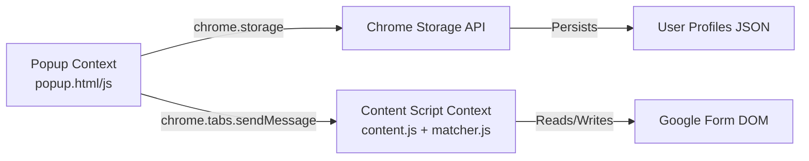

# Code Review: Autofill Placement Forms Extension

## Table of Contents
1. [Extension Flow Overview](#extension-flow-overview)
2. [File-by-File Deep Dive](#file-by-file-deep-dive)
3. [Complete User Journey](#complete-user-journey)
4. [Data Flow & Interactions](#data-flow--interactions)

---

## Extension Flow Overview

This Chrome Extension operates in **three distinct contexts**:



### The Three Contexts

| Context | Files | Purpose | Lifetime |
|:---|:---|:---|:---|
| **Popup** | `popup.html`, `popup.js` | UI for profile management & autofill trigger | Opens when user clicks extension icon, closes when popup is dismissed |
| **Content Script** | `content.js`, `matcher.js` | Injected into Google Forms pages to scan & fill fields | Lives as long as the tab is open |
| **Storage** | Chrome Storage API | Persistent data store | Permanent (until user clears extension data) |

---

## File-by-File Deep Dive

### 1. `manifest.json` - Extension Configuration

**Purpose:** Defines the extension's metadata, permissions, and entry points.

**Key Sections:**

```json
{
  "manifest_version": 3,
  "permissions": ["storage", "activeTab", "scripting"],
  "host_permissions": [
    "*://docs.google.com/forms/*",
    "*://forms.gle/*"
  ],
  "action": {
    "default_popup": "popup.html"
  },
  "content_scripts": [{
    "matches": ["*://docs.google.com/forms/*"],
    "js": ["matcher.js", "content.js"],
    "run_at": "document_idle"
  }]
}
```

**What This Means:**
- **`permissions`**: Grants access to Chrome Storage API and active tab manipulation
- **`host_permissions`**: Allows the extension to run on Google Forms URLs
- **`content_scripts`**: Automatically injects `matcher.js` and `content.js` when a Google Form loads
- **`run_at: "document_idle"`**: Scripts inject after the DOM is fully loaded but before images/resources finish

**Input:** None (declarative configuration)  
**Output:** Chrome loads the extension with these rules

---

### 2. `popup.html` - User Interface

**Purpose:** Provides the visual interface for managing profiles and triggering autofill.

**Structure:**

```html
<body>
  <!-- Main View: Profile List -->
  <div id="mainView">
    <div class="header">
      <h2>Your Profiles</h2>
      <button id="themeToggle">☀</button>
    </div>
    
    <div id="profileList">
      <!-- Profile cards dynamically inserted here -->
    </div>
    
    <button id="createProfileBtn">+ New Profile</button>
    <button id="autofillBtn">Autofill Form</button>
  </div>

  <!-- Form View: Create/Edit Profile -->
  <div id="formView" style="display:none">
    <form id="profileForm">
      <input id="fullName" required />
      <input id="email" required />
      <!-- ... more fields ... -->
    </form>
  </div>
  
  <script src="popup.js"></script>
</body>
```

**Key UI Elements:**

| Element | ID | Purpose |
|:---|:---|:---|
| Profile Card | `.profile-card` | Displays saved profile with name & email |
| Menu Button | `.menu-button` (⋮) | Opens context menu (Open/Copy/Delete) |
| Autofill Button | `#autofillBtn` | Triggers autofill on active tab |
| Theme Toggle | `#themeToggle` | Switches between light/dark mode |

**Example: Profile Card Structure**

```javascript
// From popup.js:218-256
function createProfileCard(name, profile) {
  const card = document.createElement('div');
  card.className = 'profile-card';
  card.dataset.name = name;  // Stores profile name for retrieval
  
  const icon = document.createElement('div');
  icon.className = 'profile-icon';
  icon.textContent = name.substring(0, 2).toUpperCase();  // "Work" → "WO"
  
  const profileName = document.createElement('div');
  profileName.className = 'profile-name';
  profileName.textContent = name;
  
  const meta = document.createElement('div');
  meta.className = 'profile-meta';
  meta.textContent = profile.email || '';  // Shows email as subtitle
  
  // Assemble card
  card.appendChild(icon);
  card.appendChild(profileName);
  card.appendChild(meta);
  
  return card;
}
```

**Input:** User clicks, form submissions  
**Output:** Visual feedback, triggers `popup.js` event handlers

---

### 3. `popup.js` - Popup Logic Controller

**Purpose:** Handles all popup UI interactions, profile CRUD operations, and autofill triggering.

#### 3.1 Profile Management

**Saving a Profile:**

```javascript
// From popup.js:518-545
$('profileForm').addEventListener('submit', (e) => {
  e.preventDefault();
  
  // 1. Extract form data
  const name = $('profileName').value.trim();
  const profile = buildProfileFromForm();  // Lines 128-151
  
  // 2. Validate
  const error = validateProfile(profile);  // Lines 21-29
  if (error) {
    setStatus(error, true);
    return;
  }
  
  // 3. Save to Chrome Storage
  getProfiles((map) => {
    map[name] = profile;  // Add/update profile in map
    saveProfilesMap(map, () => {
      renderProfileList();  // Refresh UI
      showMainView();
      setStatus('Profile saved');
    });
  });
});
```

**Data Structure:**

```javascript
// Example profile object
{
  version: 1,
  fullName: "John Doe",
  email: "john@example.com",
  phone: "+91-9876543210",
  rollNo: "21CSE001",
  cgpa: "8.5",
  tenthPercent: "95",
  twelfthPercent: "92",
  college: "ABC Institute of Technology",
  branch: "CSE",
  gender: "Male",
  relocate: "Yes",
  lastUpdated: 1700000000000  // Unix timestamp
}
```

#### 3.2 Autofill Trigger

**The Autofill Flow (popup.js:557-609):**

```javascript
$('autofillBtn').addEventListener('click', () => {
  // Step 1: Validate selection
  if (!currentProfile) {
    setStatus('Please select a profile first', true);
    return;
  }
  
  // Step 2: Retrieve profile from storage
  getProfiles((map) => {
    const profile = map[currentProfile];
    
    // Step 3: Get active tab
    chrome.tabs.query({ active: true, currentWindow: true }, (tabs) => {
      const tabId = tabs[0].id;
      
      // Step 4: Send message to content script
      chrome.tabs.sendMessage(
        tabId,
        { action: "autofill", profile: profile },
        response => {
          if (response && response.success) {
            // Step 5: Render preview in popup
            renderPopupPreview(response.candidates, profile, tabId);
          }
        }
      );
    });
  });
});
```

**Input:** User clicks "Autofill Form" button  
**Output:** 
1. Sends `{action: "autofill", profile: {...}}` message to content script
2. Receives `{success: true, candidates: [...]}` response
3. Displays preview overlay in popup

---

### 4. `matcher.js` - Fuzzy Matching Engine

**Purpose:** Provides intelligent field matching using aliases and scoring algorithms.

**Core Algorithm:**

```javascript
// From matcher.js:64-79
function scoreMatch(q, kw) {
  q = normalize(q);  // "Full Name" → "full name"
  kw = normalize(kw);  // "name" → "name"
  
  if (!q || !kw) return 0;
  
  // Exact phrase bonus
  if (q.indexOf(kw) !== -1) return 70;  // "full name".includes("name") → 70
  
  // Token overlap scoring
  const qt = q.split(/\s+/).filter(Boolean);  // ["full", "name"]
  const kts = kw.split(/\s+/).filter(Boolean);  // ["name"]
  
  let overlap = 0;
  kts.forEach(t => { 
    if (t && qt.includes(t)) overlap++;  // "name" in ["full", "name"] → +1
  });
  
  return (overlap * 16);  // 1 * 16 = 16 points
}
```

**Alias Dictionary:**

```javascript
// From matcher.js:16-29
const aliases = {
  fullName: [
    'name', 'full name', 'candidate name', 'your name',
    'applicant name', 'student name', 'student name (as on id)'
  ],
  email: [
    'email', 'e-mail', 'mail id', 'email address',
    'gmail', 'email id', 'preferred email'
  ],
  phone: [
    'phone', 'mobile', 'contact', 'phone number',
    'mobile number', 'whatsapp', 'whatsapp number'
  ],
  // ... more aliases
};
```

**Example Match:**

```javascript
// Question label: "What is your Full Name?"
// Profile field: "fullName"

matchQuestionToField("What is your Full Name?", profile);

// Process:
// 1. Normalize: "what is your full name"
// 2. Loop through aliases.fullName
// 3. Try "name": scoreMatch("what is your full name", "name")
//    → "what is your full name".includes("name") → 70 points
// 4. Pattern boost: No email/phone patterns → no boost
// 5. Return: {key: "fullName", value: "John Doe", score: 70}
```

**Input:** Question text (string), User profile (object)  
**Output:** `{key: "fullName", value: "John Doe", score: 70}` or `{key: null, value: null, score: 0}`

---

### 5. `content.js` - DOM Manipulation & Autofill Execution

**Purpose:** Scans Google Forms DOM, matches fields using `matcher.js`, and fills detected fields.

#### 5.1 Message Listener

```javascript
// From content.js:122-221
chrome.runtime.onMessage.addListener((msg, sender, sendResponse) => {
  if (msg && msg.action === 'autofill' && msg.profile) {
    const profile = msg.profile;
    
    // Step 1: Compute candidates
    let candidates = computeCandidatesForProfile(profile);
    
    // Step 2: Serialize for popup
    const serial = candidates.map(c => ({
      type: c.type,
      label: c.label,
      key: c.key,
      score: c.score,
      value: c.value,
      elSelector: elementToSelector(c.el)  // Convert DOM ref to CSS selector
    }));
    
    // Step 3: Send back to popup
    sendResponse({ success: true, candidates: serial });
    return true;
  }
  
  // Handle "apply" action (when user confirms in popup)
  if (msg && msg.action === 'apply' && Array.isArray(msg.candidates)) {
    msg.candidates.forEach(c => {
      if (c.type === 'text' && c.elSelector) {
        let el = document.querySelector(c.elSelector);
        if (el) fillTextInput(el, c.value);
      }
      // ... handle radio, checkbox, select
    });
    sendResponse({ success: true });
    return true;
  }
});
```

#### 5.2 Field Detection

**Text Input Detection:**

```javascript
// From content.js:425-484
const textInputs = Array.from(document.querySelectorAll(
  'input[type="text"], input[type="email"], input[type="tel"], textarea'
));

textInputs.forEach(inp => {
  // Step 1: Find label
  let label = findQuestionTextForElement(inp) || 
              inp.getAttribute('aria-label') || 
              inp.getAttribute('placeholder') || 
              '(no label)';
  
  // Step 2: Find question root (container)
  const root = inp.closest('.freebirdFormviewerComponentsQuestionBaseRoot') ||
               inp.closest('.question');
  
  // Step 3: Get root label for context
  const rootLabel = root ? getLabelTextFromRoot(root) : '';
  
  // Step 4: Combine labels for better matching
  if (rootLabel && !label.includes(rootLabel)) {
    label = (rootLabel + ' - ' + label).trim();
    // Example: "Personal Details - Name" instead of just "Name"
  }
  
  // Step 5: Match using matcher.js
  const res = window.AutofillMatcher.matchQuestionToField(label, profile);
  
  // Step 6: Add to candidates if matched
  if (res && res.key && res.value) {
    candidates.push({
      type: 'text',
      el: inp,
      label: label,
      key: res.key,
      value: res.value,
      score: res.score
    });
  }
});
```

**Radio Button Detection:**

```javascript
// From content.js:570-731
const radioInputs = Array.from(document.querySelectorAll(
  'input[type="radio"], [role="radio"]'
));

radioInputs.forEach(r => {
  const root = r.closest('.freebirdFormviewerComponentsQuestionBaseRoot');
  if (processed.has(root)) return;  // Skip if already processed
  processed.add(root);
  
  // Collect all options in this group
  const options = Array.from(root.querySelectorAll('[role="radio"]'))
    .map(opt => ({
      el: opt,
      label: getOptionLabel(opt)  // "Male", "Female", "Other"
    }));
  
  // Get question label
  const qTitle = root.querySelector('.freebirdFormviewerComponentsQuestionBaseTitle');
  let label = qTitle ? qTitle.innerText : '(no label)';
  
  // Match question
  const res = window.AutofillMatcher.matchQuestionToField(label, profile);
  
  // Find best matching option
  let chosen = null;
  let bestScore = 0;
  
  options.forEach(opt => {
    const optLabel = (opt.label || '').toLowerCase();
    const profileValue = String(profile[res.key] || '').toLowerCase();
    
    // Score option label against profile value
    const score = matchScore(profileValue, optLabel);
    if (score > bestScore) {
      bestScore = score;
      chosen = opt;
    }
  });
  
  if (chosen && bestScore >= 80) {  // Minimum confidence threshold
    candidates.push({
      type: 'radio',
      root: root,
      label: label,
      key: res.key,
      chosenLabel: chosen.label,
      options: options,
      score: bestScore
    });
  }
});
```

**Input:** Profile object from popup  
**Output:** Array of candidate objects with DOM references

---

## Complete User Journey

### Scenario: User wants to autofill a placement form

```
┌─────────────────────────────────────────────────────────────────┐
│ Step 1: User creates a profile                                  │
└─────────────────────────────────────────────────────────────────┘
  ↓
  User clicks extension icon
  ↓
  popup.html loads → popup.js initializes
  ↓
  User clicks "+ New Profile"
  ↓
  popup.js shows formView, hides mainView
  ↓
  User fills form: Name="John Doe", Email="john@example.com", etc.
  ↓
  User clicks "Save Profile"
  ↓
  popup.js:518 → validateProfile() → buildProfileFromForm()
  ↓
  chrome.storage.local.set({ profilesV1: { "Work": {...} } })
  ↓
  Profile saved ✓

┌─────────────────────────────────────────────────────────────────┐
│ Step 2: User navigates to Google Form                           │
└─────────────────────────────────────────────────────────────────┘
  ↓
  User opens https://docs.google.com/forms/d/abc123/viewform
  ↓
  manifest.json content_scripts rule matches URL
  ↓
  Chrome injects matcher.js, then content.js
  ↓
  content.js:1698 → monitor() → ensureButton() (currently disabled)
  ↓
  Content script ready, waiting for messages

┌─────────────────────────────────────────────────────────────────┐
│ Step 3: User triggers autofill                                  │
└─────────────────────────────────────────────────────────────────┘
  ↓
  User clicks extension icon
  ↓
  popup.html loads → renderProfileList() shows saved profiles
  ↓
  User clicks "Work" profile card → currentProfile = "Work"
  ↓
  User clicks "Autofill Form" button
  ↓
  popup.js:557 → chrome.tabs.sendMessage(tabId, {
    action: "autofill",
    profile: { fullName: "John Doe", email: "john@example.com", ... }
  })

┌─────────────────────────────────────────────────────────────────┐
│ Step 4: Content script processes form                           │
└─────────────────────────────────────────────────────────────────┘
  ↓
  content.js:122 → onMessage listener receives message
  ↓
  content.js:128 → computeCandidatesForProfile(profile)
  ↓
  Scans DOM:
    - document.querySelectorAll('input[type="text"]')
    - document.querySelectorAll('[role="radio"]')
    - document.querySelectorAll('select')
  ↓
  For each field:
    1. Extract label (aria-label, placeholder, parent text)
    2. Call matcher.js → matchQuestionToField(label, profile)
    3. If score > threshold, add to candidates[]
  ↓
  Example candidates:
    [
      { type: "text", label: "Full Name", key: "fullName", 
        value: "John Doe", score: 70, el: <input> },
      { type: "radio", label: "Gender", key: "gender", 
        chosenLabel: "Male", score: 85, root: <div> },
      { type: "select", label: "Branch", key: "branch", 
        chosen: {label: "CSE", value: "CSE"}, score: 90, el: <select> }
    ]
  ↓
  content.js:132 → Serialize candidates (convert DOM refs to selectors)
  ↓
  content.js:174 → sendResponse({ success: true, candidates: [...] })

┌─────────────────────────────────────────────────────────────────┐
│ Step 5: Popup shows preview                                     │
└─────────────────────────────────────────────────────────────────┘
  ↓
  popup.js:597 → renderPopupPreview(candidates, profile, tabId)
  ↓
  Creates preview overlay:
    ┌──────────────────────────────────┐
    │ Autofill preview                 │
    ├──────────────────────────────────┤
    │ Full Name      │ John Doe        │
    │ Gender         │ Male            │
    │ Branch         │ CSE             │
    ├──────────────────────────────────┤
    │ [Close] [Apply to page]          │
    └──────────────────────────────────┘
  ↓
  User reviews and clicks "Apply to page"

┌─────────────────────────────────────────────────────────────────┐
│ Step 6: Content script fills form                               │
└─────────────────────────────────────────────────────────────────┘
  ↓
  popup.js:653 → chrome.tabs.sendMessage(tabId, {
    action: "apply",
    candidates: [...]
  })
  ↓
  content.js:185 → onMessage listener receives "apply" action
  ↓
  For each candidate:
    if (type === 'text') {
      el = document.querySelector(elSelector);
      el.value = candidate.value;
      el.dispatchEvent(new Event('input', {bubbles: true}));
      el.dispatchEvent(new Event('change', {bubbles: true}));
    }
    else if (type === 'radio') {
      opt = root.querySelector('[role="radio"]');
      opt.click();
    }
    // ... handle select, checkbox
  ↓
  Form fields filled ✓
  ↓
  content.js:215 → sendResponse({ success: true })
  ↓
  popup.js:657 → setStatus('Applied successfully')
```

---

## Data Flow & Interactions

### Storage Schema

```javascript
// Chrome Storage Structure
{
  "profilesV1": {
    "Work": {
      version: 1,
      fullName: "John Doe",
      email: "john@example.com",
      // ... other fields
      lastUpdated: 1700000000000
    },
    "Personal": {
      version: 1,
      fullName: "John Doe",
      email: "john.personal@gmail.com",
      // ... other fields
      lastUpdated: 1700000001000
    }
  },
  "lastUsedProfile": "Work",
  "theme": "dark"
}
```

### Message Passing

**Popup → Content Script:**

```javascript
// Message format
{
  action: "autofill",
  profile: {
    fullName: "John Doe",
    email: "john@example.com",
    // ... complete profile object
  }
}

// Response format
{
  success: true,
  candidates: [
    {
      type: "text",
      label: "Full Name",
      key: "fullName",
      value: "John Doe",
      score: 70,
      elSelector: "input.freebirdFormviewerComponentsQuestionTextInput"
    },
    // ... more candidates
  ]
}
```

**Popup → Content Script (Apply):**

```javascript
// Message format
{
  action: "apply",
  candidates: [
    {
      type: "text",
      elSelector: "input.freebirdFormviewerComponentsQuestionTextInput",
      value: "John Doe",
      key: "fullName"
    },
    // ... more candidates
  ]
}

// Response format
{
  success: true
}
```

### Event Simulation (Why it's needed)

**The Problem:**
Google Forms uses React/Angular frameworks that track state internally. Simply setting `input.value = "John Doe"` updates the DOM but **not** the framework's internal state.

**The Solution:**

```javascript
// From content.js (referenced in apply logic)
function fillTextInput(el, value) {
  el.value = value;  // Update DOM
  
  // Trigger framework change detection
  el.dispatchEvent(new Event('input', { bubbles: true }));
  el.dispatchEvent(new Event('change', { bubbles: true }));
  el.dispatchEvent(new Event('blur', { bubbles: true }));
}
```

**Why Each Event:**
- `input`: Triggers React's `onChange` handler (real-time validation)
- `change`: Triggers form validation and state updates
- `blur`: Signals that the user has "left" the field (important for some validators)

---

## Summary

This extension operates through a **three-layer architecture**:

1. **Popup Layer** (`popup.html/js`): User interface for profile management
2. **Matching Layer** (`matcher.js`): Intelligent field recognition using fuzzy logic
3. **Execution Layer** (`content.js`): DOM manipulation and form filling

The data flows in a **request-response pattern**:
- Popup requests autofill → Content script computes candidates → Popup shows preview → User confirms → Content script applies changes

This separation ensures:
- **Security**: Content scripts can't access Chrome APIs directly
- **Modularity**: Matcher logic is reusable and testable
- **User Control**: Preview step prevents accidental data submission
